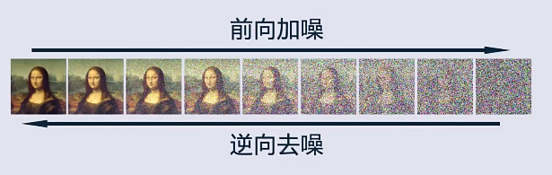
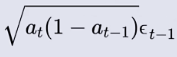
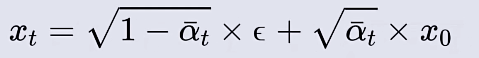
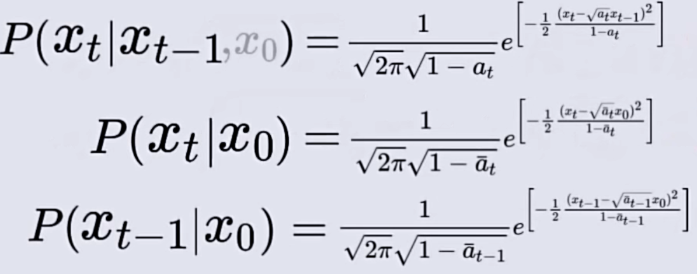

## 1.定义

扩散粒子从高浓度区域向低浓度区域移动的过程

## 2.大致的过程

向图片中不断地加入高斯噪声来模拟这种现象。

**==并且通过逆向过程从随机噪声中生成图片==**

## 3.前向加噪

- 先将图片的像素通过归一化映射到【-1,1】的区间
- 随机采样生成一张同样大小的噪声图片（数值遵从标准正态分布）
- 归一化的图片和噪声图片进行混合
  
  
- 前向加噪的总过程
  
  

- 前向加噪的公式进行简化
  
  
  
  
  -  采样两次转化为在叠加的概率分布中采样一次
    
    对于两种概率模型进行卷积操作：计算两个分布的所有可能的组合情况
    
    h(x) = (f * g)(x) = ∫[−∞,∞] f(x − t)g(t) dt
    
    
    
    所以能得到如上的情况
  - 用如上的方法叠加概率模型和概率模型
    
    有得知：**==系数和标准差都会变成原来的系数倍==**
    
    所以，最终得到
    
    
    
    
  - 用数学归纳法进行推导，得出
    
    
    
    简化得出
    
    
    
    以上就是前向加噪的全部过程

## 3.反向过程

- 目标：从xT的噪声图片中回复得到x0时刻的原图
- 关于贝叶斯公式
  
  
  - P(A):先验概率：表示基于经验的A事件发生的概率
  - P(A|B):后验概率： 表示基于事实B后事件A发生的概率（反向）
  - P(B|A):归因力度： A事件发生后发生B事件（正向）
  
  xt-1时刻到xt时刻是一个随机的过程
  
  所以得到这个公式
  
  
  
  
  
  所以对于P(xt|xt-1)和P(xt|x0)来说
  
  
  
  
  
  
  
  
  
  
  
  
  
  把x0用xt进行替换
  
  
  
  **==对于任意一个xt的图像，都可以认为是由x0原图直接加噪而来的==**

## 训练的方向

输入一个xt的图像，来预测相对于某个x0原图所加入的噪声

## 训练的过程

## 推导的过程

