# 总纲

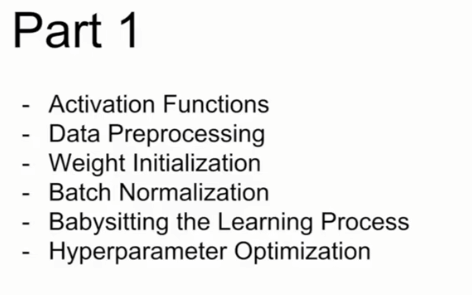

## Activate Function

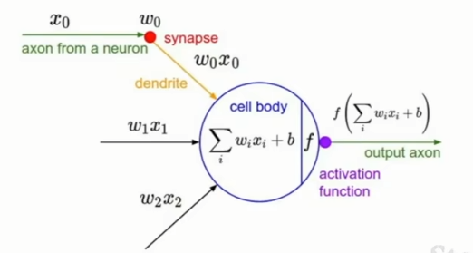

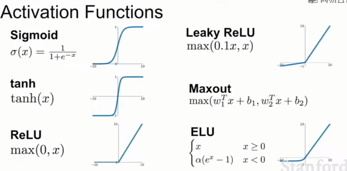

### Sigmoid

1. 梯度消失
   
   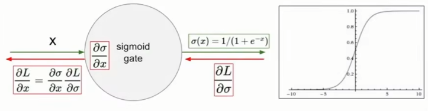
2. 非零中心
   
   权值始终为正
   
   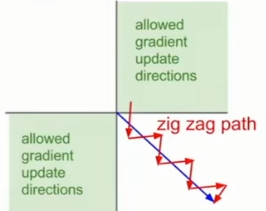
   
    
3. 幂运算计算开销大：Sigmoid函数的计算涉及指数和除法运算，这些运算在硬件上相对较慢。因此，与其他激活函数相比，使用Sigmoid函数可能会增加模型的计算成本。
4. 不是稀疏激活：Sigmoid函数的输出范围是连续的，而不是稀疏的。这意味着大部分神经元在任何给定时间点上都会被激活，这可能会浪费计算资源并增加模型的复杂性。

### tanh

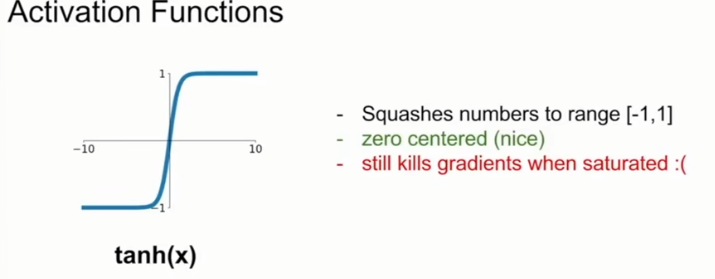

### Relu

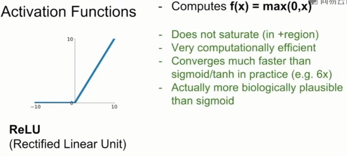

非饱和性：ReLU函数在输入大于零时保持激活状态，不会出现梯度消失的问题。这有助于提高模型的学习速度和梯度传播的稳定性。

稀疏激活性：ReLU函数的输出是稀疏的，即当输入为负时输出为零。这意味着在网络中的大部分神经元在任何给定时间点上都是非激活状态，从而减少了计算量和存储需求。

强化稀疏特性：ReLU函数的稀疏性有助于模型学习到更具有区分度的特征表示。它可以通过选择性地激活神经元来提高模型的表示能力。

支持稳定的梯度传播：ReLU函数的梯度在输入为正时始终为1，这有助于在反向传播过程中稳定地传播梯度。

**==需要注意的是，ReLU函数在输入小于等于零时输出为零，因此它对负值不具有区分性。在某些情况下，可能会出现“死亡神经元”问题，即一些神经元在训练过程中永远不会被激活，导致它们不再更新权重。为了解决这个问题，一些变体的ReLU函数被提出，如Leaky ReLU和Parametric ReLU，它们在输入为负时引入了一定的斜率，以避免死亡神经元问题。==**

## 可以初始化偏置，来尽量减少dead的产生

弹幕：假设输入数据为二维，这里由于随机初始化w且每个w向量唯一对应二维平面内的一条直线，同时也可代表一个神经元（直线上方的区域表示该神经元的输出为正，下方为负，而为负的会导致回传梯度为0，即神经元无法更新）

## 什么是鲁棒性

鲁棒性是指系统或模型对于输入数据的干扰、噪声或异常值的抵抗力或稳定性。一个鲁棒的系统或模型能够在面对不完美或具有噪声的输入时，仍然能够产生合理、可靠的输出结果。

在机器学习和深度学习领域中，鲁棒性是一个重要的概念。一个鲁棒的机器学习模型能够在遇到各种不确定性和变化时仍能保持良好的性能。这些不确定性和变化可以包括数据中的噪声、异常值、缺失数据、领域迁移、对抗性攻击等。

具有鲁棒性的模型能够在输入数据中存在噪声或异常情况下做出准确的预测或推断。它们能够对输入数据中的变化做出适应，并且不会因为少量的噪声或异常值而产生过度的影响。

对于深度学习模型而言，提高鲁棒性可以带来许多好处。鲁棒的模型可以更好地处理现实世界中的复杂数据和噪声，提高模型的泛化能力，减少过拟合的风险，并提高模型在未见过的数据上的性能。

为了提高模型的鲁棒性，可以采取一些策略，例如数据增强、正则化、模型集成、对抗性训练等。这些策略有助于使模型对于不确定性和变化具有更好的适应能力，提高模型的鲁棒性。

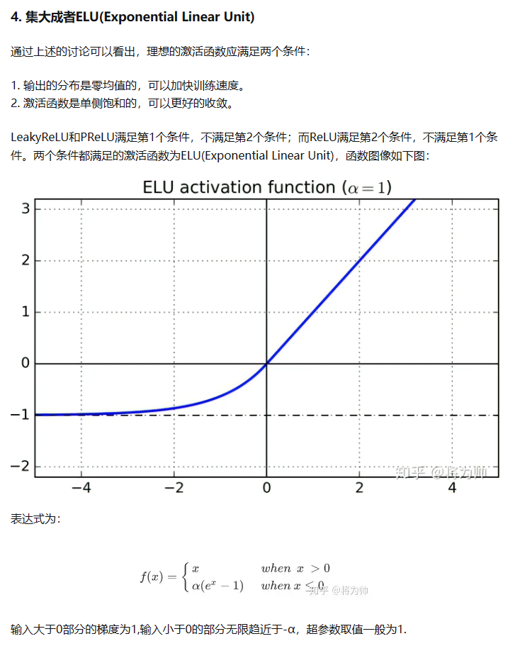

## 输出最大神经元

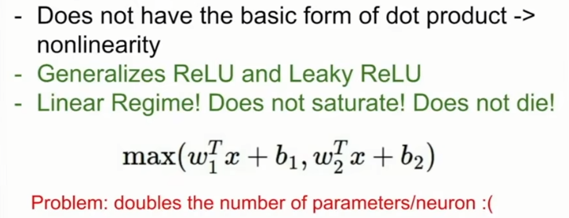

只是提取线性函数的最大值->这是另一个线性机制的操作

神经元和权重数量翻倍

## 但是常规的方法依然是relu

但是要慎重的选择学习率

使用合适的权重初始化：确保权重的初始化范围适当，并避免权重初始化过大或过小。一种常用的方法是使用Xavier或He等初始化方法。

# data Preprocessing

去除尺度影响：不同特征可能具有不同的度量单位和范围，例如一个特征的取值范围在0到1之间，而另一个特征的取值范围在100到1000之间。这种情况下，由于尺度不同，模型可能会受到数据中尺度较大特征的影响更多。通过归一化处理，可以将所有特征缩放到相似的尺度范围，使得模型能够更平衡地对待所有特征。

提高模型收敛速度：在一些机器学习算法中，例如梯度下降法，模型的收敛速度可能受到数据尺度的影响。如果数据的尺度差异很大，那么算法可能需要更多的迭代次数才能收敛到最优解。通过归一化处理，可以加快模型的收敛速度，减少训练时间。

避免异常值对模型的影响：异常值是指与其他数据点明显不同的观测值。在某些情况下，异常值可能对模型产生不良影响，例如线性回归模型中，一个具有异常值的特征可能对模型的拟合产生显著影响。通过归一化处理，可以减小异常值的影响，使得模型更加稳健。

改善特征分布：某些机器学习算法，如K近邻算法和支持向量机，对特征分布敏感。如果特征不服从高斯分布或其他符合算法假设的分布，那么模型的性能可能会受到影响。通过归一化处理，可以使特征更接近正态分布，从而改善模型的表现。

### 关于图像的处理中，每个元素减去整张图像的均值，和减去各个通道的均值，有什么区别，什么更好？

减去整张图像的均值：
这种方法计算图像中所有像素的平均值，然后将该平均值从每个像素中减去。这意味着整个图像的亮度被调整为接近零均值。

优点：

通过减去整张图像的均值，可以减少图像中的全局亮度偏移。这对于一些任务（如目标检测）可能是有益的，因为它可以减少图像中的背景变化。
整张图像的均值对整体图像特征起到了一种“标定”的作用，可以在某些情况下提高图像处理的鲁棒性。
缺点：

在某些情况下，减去整张图像的均值可能会造成图像中的细节信息损失。如果图像中包含重要的细节或纹理特征，这种方法可能不是最佳选择。
减去各个通道的均值：
这种方法计算每个颜色通道（如红色、绿色和蓝色）的平均值，并将每个通道的平均值从相应通道的像素中减去。这样做的目的是调整每个通道的亮度。

优点：

减去各个通道的均值可以更好地保留图像中的细节信息，因为它只调整每个通道的亮度，而不是整个图像。
在某些情况下，不同通道之间的亮度差异可能是有意义的。例如，对于某些图像分类任务，不同颜色通道的亮度差异可能包含有用的特征信息。
缺点：

如果图像中的背景或全局亮度变化对于任务不重要，那么减去各个通道的均值可能没有明显的优势。

## 参数的初始化的设置

 

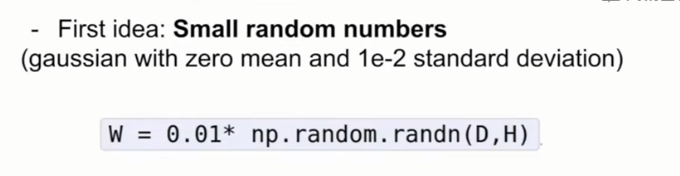

基于标准概率分布随机抽取*0.01作为初始化的参数

为什么是打破了参数对称的问题：在浅层的网络不存在问题，但是在深层网络上有问题

所有的激活值都有变成0的风险，这样就传不回来梯度了

### 所以修改0.01为1*标准差

问题：过饱和

### 最终的方案是采用Xavier初始化方法

 

 

## Batch Normalization

### 对其进行的操作：进行标准化：均值为0，方差为1

- 避免梯度下降 -> 归一化
- 让神经网络学习到更加合适的数据的表示 -> 标准的分布更好地适应激活函数的激活范围
  
  对此更加详细的描述是：
  
  每个层的输入分布更加的稳定，能够减少训练过程中的==**内部协变量**==的偏移
  
  ### 什么是内部协变量？
  
  具体来说，当网络的前一层参数发生变化时，传递给后一层的输入分布也会发生变化，这就是内部协变量偏移的产生。
  
  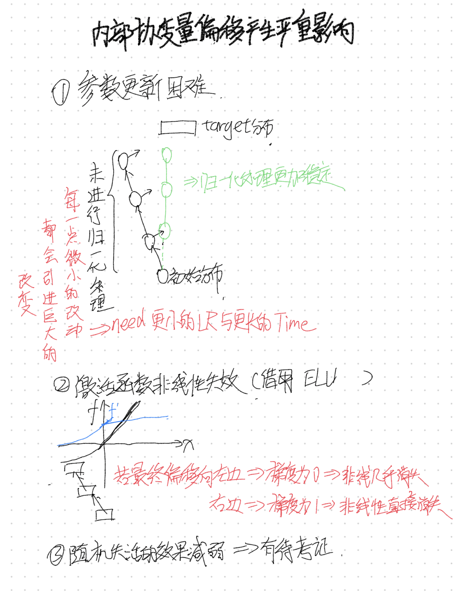
- 具有一定的正则化的效果，减少对于其他正则化（如dropour）的依赖
  - 子批次噪声：Batch Normalization在训练过程中对每个子批次进行归一化。这会引入一定程度的噪声，因为每个子批次的样本是随机抽取的。这个噪声可以被视为一种正则化机制，类似于在训练过程中使用dropout。
  - 权重缩放：在Batch Normalization中，对每个特征维度进行归一化后，还会应用可学习的缩放因子和偏移量来恢复特征的表达能力。这些缩放因子和偏移量的学习过程对权重的限制起到了一定的正则化作用。
  
   

## Babysitting the Learning Process

# 总结

 

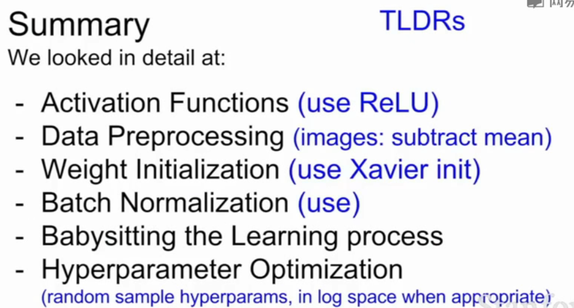

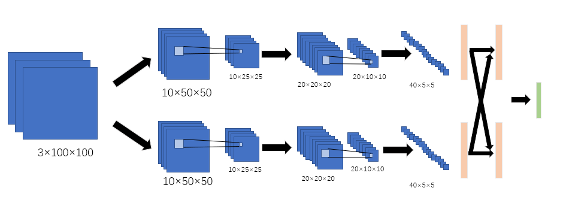
